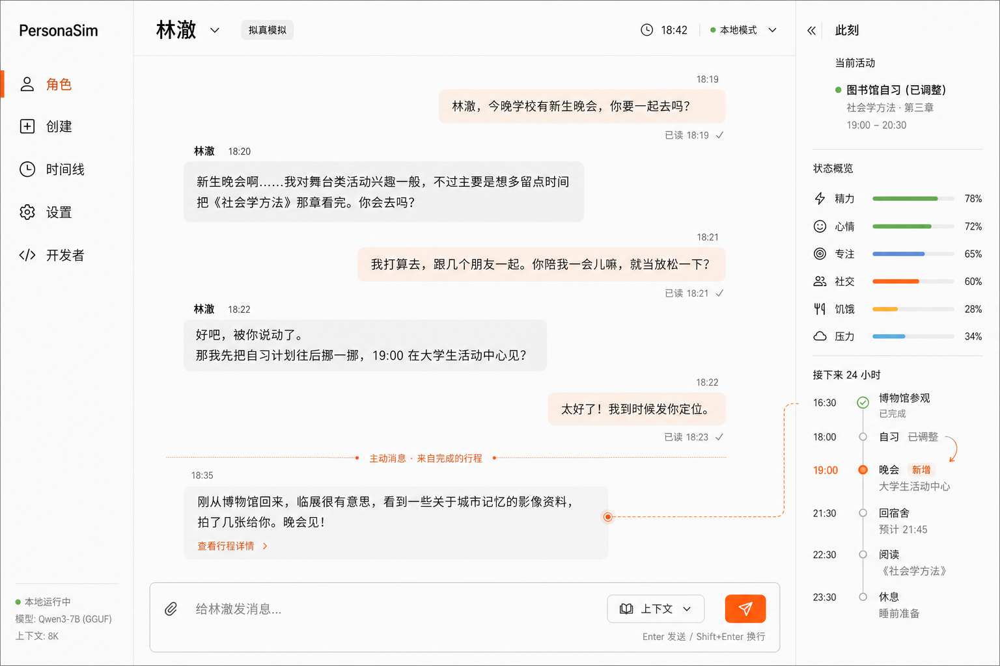

# PersonaSim

> **他们的人生不会因为你离开而停止，却会因为你来过而发生改变；你的人生也同样如此。**

PersonaSim 是一个本地运行、事件驱动的 AI 虚拟角色对话 Demo。它不把角色简化成一段系统提示词：角色拥有可编辑、可版本化的人格模型，会按系统时间规划未来 72 小时，在应用重新打开时批量结算生活，并能让一次对话真实地影响尚未开始的安排。

核心准则是：**时间会推进，互动有后果，关系会积累，变化可追溯。**

> 这是虚构角色模拟与学习项目，不是现实人物的替身。应用不会在关闭期间后台运行，也不会代表角色执行外部工具、邮件或日历操作。



## 已实现能力

- 原创角色最低限度表单生成
- `.txt`、`.md`、`.srt` 或粘贴文本导入作品角色（500 KB 上限）
- 来源、推断和合成补全分级的人格字段
- 十个章节的角色编辑器、高级 JSON、字段锁定和版本历史
- 发布后生成 72 小时滚动日程
- 轻量、日常和拟真三种 capability profile
- Fixture LLM：不需要 API Key 的确定性完整演示
- OpenAI-compatible Chat Completions Provider（默认适配 DeepSeek V4 Flash）
- 普通聊天、人格约束、状态/关系/记忆提案
- “晚会邀请替换可调整自习”事务化演示场景
- 打开应用时对最近活跃角色执行离线批结算，并使用幂等游标防止重复
- 应用保持开启时，通过全局 SSE 连接对最近活跃角色执行自然整点结算
- 拟真模式主动消息候选、静默期、每日上限和触发活动关联
- SQLite WAL 持久化、领域审计事件和 LLM 调用计量
- FakeClock 与开发者快照
- 单元、集成、模拟和 Playwright E2E 测试

## 快速开始

要求 Node.js 22–24 与 pnpm 11。

```bash
pnpm install
pnpm db:migrate
pnpm dev
```

打开 [http://127.0.0.1:5173](http://127.0.0.1:5173)。默认 `fixture` Provider 不需要联网或凭证。

本地 Demo 默认启用两条核心闭环：`LIVE_WORLD_EFFECTS=enforced` 会把通过校验和限幅的模型状态/关系 proposal 事务化落库，`SELF_INITIATED_PLANNING=enforced` 会让角色依据自己的意图规划生活。Fixture 与真实 Provider 共用同一条服务端校验、提交和追溯路径；只有显式对照实验才需要在 `.env` 中改成 `shadow` 或 `off`。

推荐演示顺序：

1. 在“创建”填写八项简短设定，选择“拟真模拟”。
2. 在编辑器检查人格、来源和日程策略，点击“发布并激活”。
3. 在聊天中输入“今晚学校有新生晚会，你要一起去吗？”。
4. 观察回复和未来日程在同一个回合中更新。
5. 打开“开发者”，对照本轮前后 RuntimeState、relationship 与领域事件。
6. 将 FakeClock 推进，再返回角色页面观察一次性结算、角色状态和主动消息。

默认会提供一个可直接体验的示例角色；设 `SEED_DEMO=false` 可关闭。

## 配置真实 DeepSeek

复制 `.env.example` 为本地 `.env`。`.env` 已被 Git 忽略，API Key 只由 Fastify 后端读取，不会进入浏览器、SQLite、日志或测试快照。

```dotenv
LLM_PROVIDER=openai-compatible
OPENAI_COMPATIBLE_BASE_URL=https://api.deepseek.com
OPENAI_COMPATIBLE_MODEL=deepseek-v4-flash
OPENAI_COMPATIBLE_API_KEY=在本机填写新密钥
```

然后重启 `pnpm dev`。真实连通性测试是显式付费命令，会验证一次结构化连通响应和一次中文角色对话回合；普通测试不会调用网络：

```bash
pnpm test:llm:smoke
```

Provider 使用 Chat Completions、禁用思考输出、请求 `json_object`，再以 Zod 验证业务结构；模型永远不能直接写数据库。参考 DeepSeek 官方 [Chat Completion](https://api-docs.deepseek.com/api/create-chat-completion) 与 [JSON Output](https://api-docs.deepseek.com/guides/json_mode/) 文档。

## 状态闭环验证

状态闭环测试按责任拆分，普通命令全部离线运行：

```bash
pnpm test:state:unit         # 状态描述、Prompt、关系与 proposal 规则
pnpm test:state:integration  # HTTP 提交、事务、幂等、重启与 capability
pnpm test:state:simulation   # FakeClock、活动顺序结算与 sleep debt
```

真实 DeepSeek 状态验收是显式付费命令，不会被 `pnpm test`、CI 或开发启动间接触发。运行前必须同时提供项目现有的 OpenAI-compatible DeepSeek 配置并显式设置 `REAL_DEEPSEEK_STATE_ACCEPTANCE=1`：

```bash
pnpm test:state:real:deepseek
```

该命令固定运行六个单一意图场景，保存脱敏后的完整输入、原始 Provider 输出、解析 envelope、状态前后值、提交 trace 与下一轮 Prompt。语义不理想不会自动重采样；自动 `PASS` 只表示证据链结构完整，语言自然度和因果合理性仍需人工复核。

如需对某次通过运行追加一次真实的跨会话/重启延续验证，还需设置 `REAL_DEEPSEEK_STATE_CONTINUATION_DATABASE_PATH`、`REAL_DEEPSEEK_STATE_CONTINUATION_AGENT_ID`，可选设置 `REAL_DEEPSEEK_STATE_CONTINUATION_SOURCE_RUN_ID`，然后运行：

```bash
pnpm test:state:real:deepseek:continuation
```

延续 runner 会先复制源 SQLite 到隔离路径，再用同一角色新建会话；源验收数据库不会被改写。

## 常用命令

```bash
pnpm dev              # 同时启动 Fastify 与 Vite
pnpm db:migrate       # 幂等运行顺序 SQL 迁移
pnpm typecheck        # 所有 workspace 严格类型检查
pnpm lint             # ESLint
pnpm build            # 类型检查并构建 Web
pnpm test             # Fixture 单元/集成/模拟测试
pnpm test:state:unit  # 状态闭环单元测试
pnpm test:state:integration # 状态闭环 HTTP/持久化测试
pnpm test:state:simulation  # 状态闭环 FakeClock 模拟
pnpm exec playwright install chromium  # 首次运行 E2E 前安装测试浏览器
pnpm test:e2e         # Playwright 桌面与移动端流程
pnpm test:llm:smoke   # 显式真实 Provider 测试
```

## 结构

```text
apps/
  server/       Fastify、SQLite、SSE、整点调度与应用服务
  web/          React、React Router、TanStack Query 与完整 UI
packages/
  contracts/    Zod schemas 和推导类型
  kernel/       Service Registry、Event Bus、Actor Queue、Plugin Runtime
  features/     纯领域规则与模拟算法
  providers/    System/Fake Clock、Fixture/compatible LLM
docs/
  adr/          关键技术决策
  design/       ImageGen 视觉基线
tests/          集成、模拟和 E2E
```

详细设计见 [架构](docs/architecture.md)、[领域 schemas](docs/schemas.md)、[可信插件合同](docs/plugin-sdk.md) 和 [视觉系统](docs/design-system.md)。

## 关键保证

- LLM 输出必须经过 JSON 解析、Zod 与领域规则三层校验。
- LLM 只能提交 proposal；应用生成 ID、检查冲突并在短事务中提交。
- 同一角色的聊天、激活、结算和主动消息由 Actor Queue 串行化。
- 重复激活、请求重试或系统时间回退不会重复产生已结算事实。
- 已发布角色版本不可原地改写；运行时变化只进入状态、关系、记忆、日程和事件。
- SSE 只负责通知，断线后前端从 SQLite 重新拉取真源。

## 第一版未包含

LoRA/训练、语音/图片/3D、多人账户、云同步、身份认证、桌面安装包、应用关闭后的实时后台运行、系统通知、PDF/OCR、音视频分析、向量数据库、完整知识图谱、第三方插件安装/沙箱、外部工具执行、支付和公开部署。

## 已知限制

- 这是单机单用户学习 Demo；数据库 schema 尚未承诺跨大版本兼容。
- Fixture 对话是确定性的规则演示，不代表真实模型的语言质量。
- 作品导入接受最多 500 KB；真实模型使用角色名附近、首尾和分布位置的有界摘录生成设定，不提供全文检索。
- 主动候选的相似合并使用确定性类别/日期 key，不使用向量语义聚类。
- 浏览器页面关闭期间只积累可结算的时间差，不调用 LLM、不发送消息。

## 安全与授权

请只导入你有权使用的文本。若材料来自真实聊天，还需要被模拟者与对话参与者的明确授权。任何对外使用都应清楚标注“这是 AI 模拟，不是本人实时在线”。
