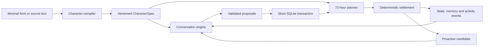

# PersonaSim architecture

PersonaSim is a local, event-driven character simulation. The model generates language and bounded proposals; application code owns time, authorization, validation and persistence.



## Three independent loops

1. **Compilation:** user fields or text evidence become a draft `CharacterSpec`; a human edits and publishes an immutable version.
2. **Conversation:** recent messages plus bounded persona/state/schedule/memory context become a reply and mutation proposal. Zod and domain rules validate the proposal before an atomic commit.
3. **Simulation:** activation or an aligned top-of-hour tick advances scheduled activities in one batch. The app never replays one model call per missed hour.

## Workspace boundaries

- `packages/contracts`: shared Zod schemas and inferred TypeScript types.
- `packages/kernel`: service registry, event bus, actor queue and trusted plugin lifecycle.
- `packages/features`: pure schedule, settlement, state, memory, relationship, prompt and proactive rules.
- `packages/providers`: system/fake clocks and fixture/OpenAI-compatible LLM implementations.
- `apps/server`: Fastify routes, SQLite migrations/repositories, transactions, scheduling and SSE.
- `apps/web`: React Router application and TanStack Query cache.

## Concurrency and transactions

All mutations for one character run through `ActorQueue.runExclusive(agentId, task)`. Different characters may progress concurrently. Model/network calls are never held inside a SQLite transaction. Once a proposal is available, a short transaction persists every mutually dependent projection and audit event.

For a chat turn this means:

```text
settle if necessary
→ read one consistent context snapshot
→ call LLM outside SQLite transaction
→ validate/repair proposal
→ atomic user message + assistant message + schedule/state/memory changes
→ publish SSE invalidation events
```

## Time

- Storage: ISO-8601 UTC instants.
- Presentation and policy: the character's IANA timezone.
- Offline: activation compares the monotonic settlement cursor to current time and performs one batch.
- Open page: the server schedules a fresh timeout to the next natural top of hour for connected characters.
- Clock rollback: the cursor and terminal activity states never move backward.

## SSE delivery

SSE is a notification channel, not the source of truth. Events tell the browser to refetch `messages`, `state`, `schedule` or `timeline`. A reconnect therefore cannot lose committed state.

## Profiles

| Capability                  | lightweight | daily | high_fidelity |
| --------------------------- | ----------- | ----- | ------------- |
| Structured persona and chat | yes         | yes   | yes           |
| 72-hour schedule            | no          | yes   | yes           |
| Offline/hourly settlement   | no          | yes   | yes           |
| Dynamic state and memory    | minimal     | yes   | yes           |
| Proactive dialogue          | no          | no    | yes           |
