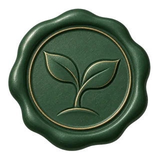
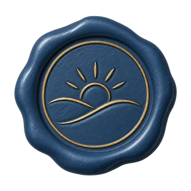
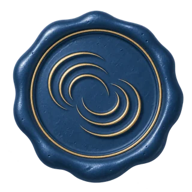
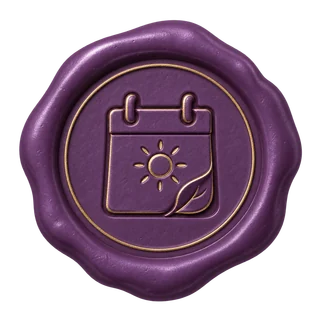
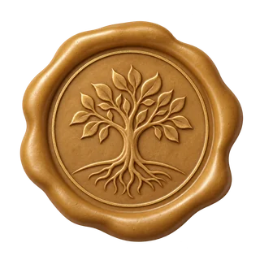
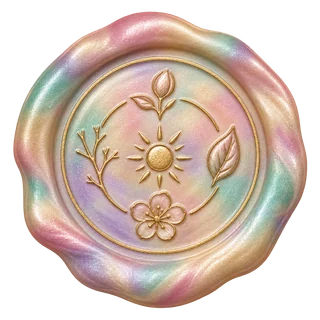
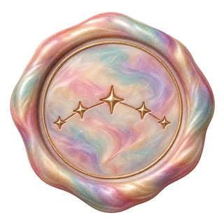

# 火漆章与成就便签墙

用户选定 C 组精致鎏金火漆，并要求图案与 Dearvale 的书信、陪伴、自然和共同故事有关。成就页采用暖灰墙面、象牙/鼠尾草/浅玫瑰纸便签，火漆章跨过便签顶部固定纸面；保留真实成就内容、分类、角色筛选、详情、日期和分页。

## 16 枚正式图案

| 成就       | 火漆颜色 | 压印寓意                            | 预览                                                                                    |
| ---------- | -------- | ----------------------------------- | --------------------------------------------------------------------------------------- |
| 初来乍到   | 酒红     | 打开的门与叶枝，第一次进入 Dearvale |             |
| 故事的开端 | 酒红     | 羽毛笔与书页，亲手开始一个故事      |        |
| 第一声问候 | 酒红     | 两个相互回应的对话气泡              |        |
| 见字如面   | 酒红     | 封好的信封，寄出的第一封信          |       |
| 远方回音   | 酒红     | 收到信件的邮箱                      |        |
| 亲手启封   | 酒红     | 打开的信封与信纸                    |         |
| 三日之约   | 松绿     | 初生嫩芽，陪伴开始生长              |         |
| 一些日常   | 松绿     | 两片叶子与枝条，平常却留存的时刻    |           |
| 一周相伴   | 深蓝     | 日出与小径，一起走过的日子          |            |
| 渐成回响   | 深蓝     | 交汇的涟漪，彼此的回响              |           |
| 日常有你   | 紫色     | 日历、太阳与叶片，相聚成为日常      |       |
| 岁月留痕   | 紫色     | 花枝，岁月中留下的共同记忆          |         |
| 长久的回响 | 金色     | 扎根的树，长久陪伴                  |             |
| 独一份纪念 | 金色     | 星光与打开的故事书                  |           |
| 岁岁相伴   | 珠母极光 | 围绕太阳的四季植物，完整的一年      |          |
| 珍藏此刻   | 珠母极光 | 相连的星座，连成故事的珍贵时刻      |  |

## 资产与重新导出

- 内置 imagegen 独立生成，PNG 原图保留在 `apps/web/public/dearvale/achievements/wax-v2/{key}.png`，不使用 CSS 重绘或染色替代火漆图案。
- 正式图为 1024×1024 WebP，缩略图为 320×320 WebP，均保留真实 alpha，不裁切不规则蜡边。`manifest.json` 记录每个输出的尺寸、透明检查、颜色、文件大小和 SHA-256。
- `pnpm achievement:assets` 检查全部原图透明背景与尺寸，再重新导出 WebP 和缩略图。这个命令不调用生图服务、不改变图案内容。
- 完整提示词和原始来源：[连续陪伴与高阶纪念](./production-prompts-milestones.json)、[书信与日常纪念](./production-prompts-letters.json)。[第一轮参考图](./wax-seal-references/README.md)保留供追溯。

## 页面设计

[整体概念](./wax-wall-concept.png)与[概念提示词](./wax-wall-concept-prompt.txt)用于约束纸墙、纸色、章的位置、文字层次和控件布局。实际界面保留项目已有侧栏及正确的中文文案，不采用概念图生成的多余侧栏诗句。

桌面三列便签，手机两列；纸张轻微错落，章跨过纸张上边缘。视觉细节用独立样式实现，文字和控件保持原生 HTML。火漆图像使用 `contain`、稳定尺寸和多级加载回退；已有专属图在重绘等待和失败期间继续展示。

最终实页截图：[桌面六档便签墙](./wax-wall-desktop.png)、[手机两列便签墙](./wax-wall-mobile.png)。截图由成就流程端到端测试使用六档测试数据生成，展示正式静态图；不代表当前用户已解锁全部成就。已与概念图逐项核对墙面、纸色、火漆跨边位置、信息层次和筛选布局，并将规律条纹调整为细微纸粒。

验收包括 10 项成就流程端到端测试，以及纸粒调整后的 2 项桌面/手机视觉结构复测；覆盖筛选、详情、键盘操作、透明火漆完整显示、两列手机布局和图片加载回退。项目类型检查、生产构建，以及组件、Provider、任务、迁移、历史版本和备份相关测试通过。实际开发页面在浏览器核对，控制台未发现错误。

后台 v2 生图、历史保留、重绘和恢复操作见 [管理说明](../../achievement-wax-images.md)。
