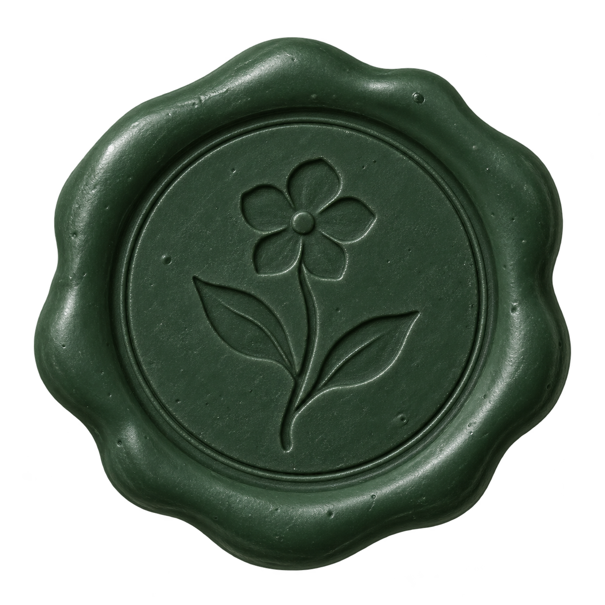
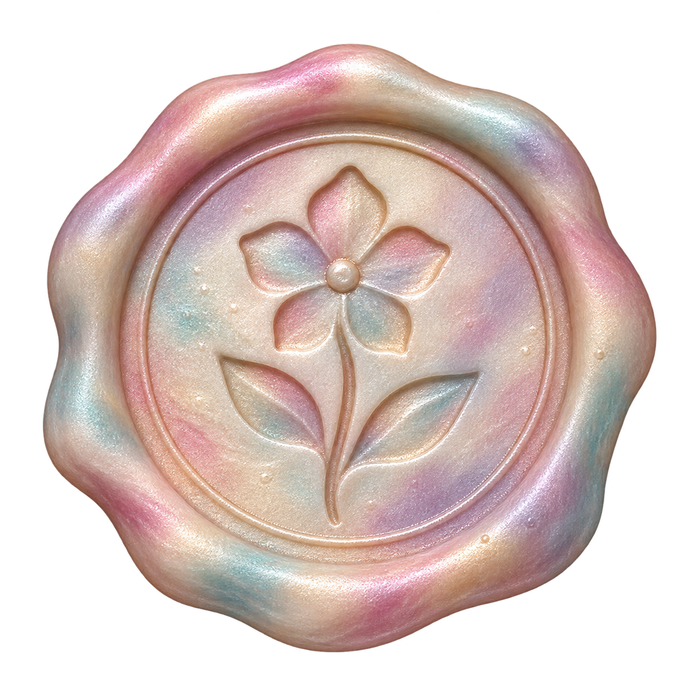
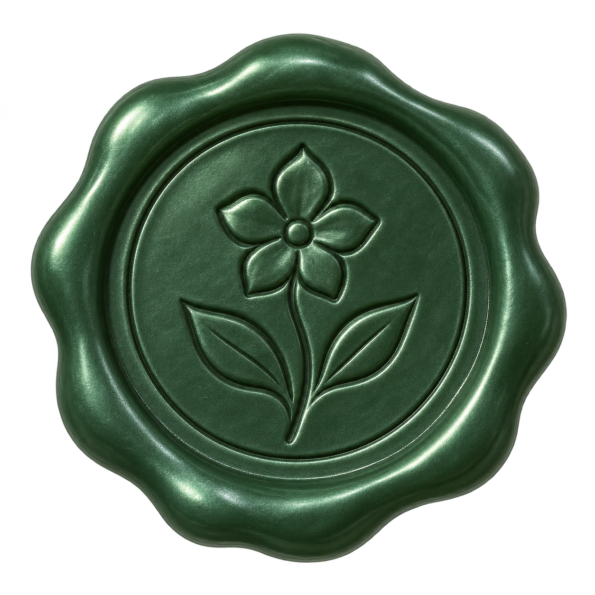
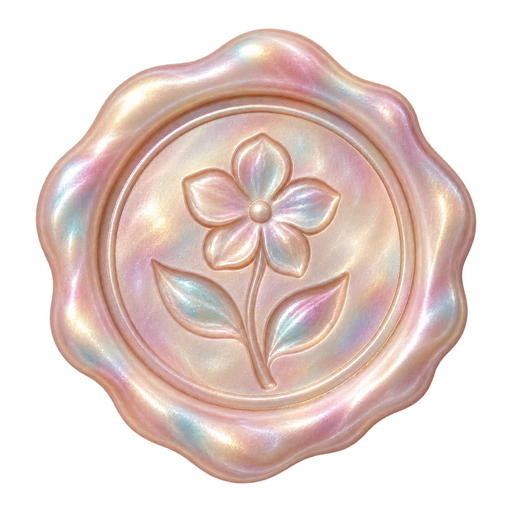
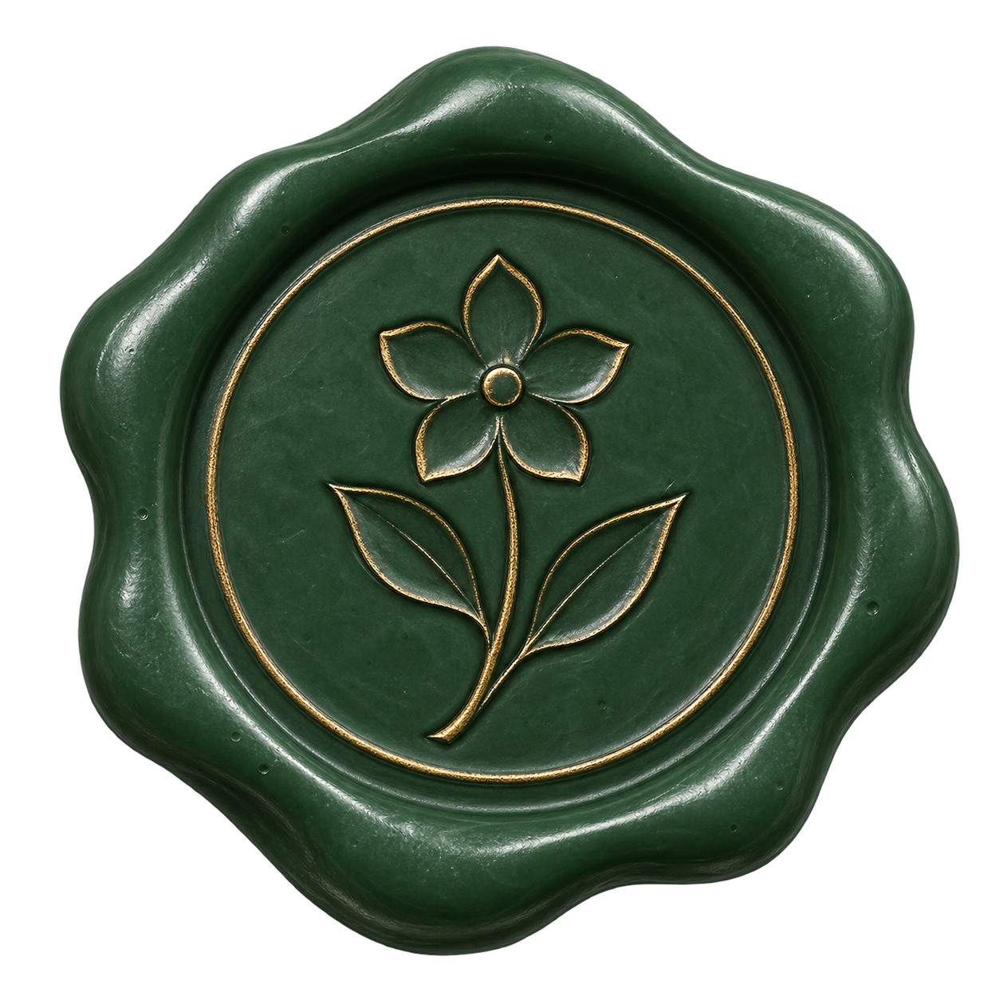
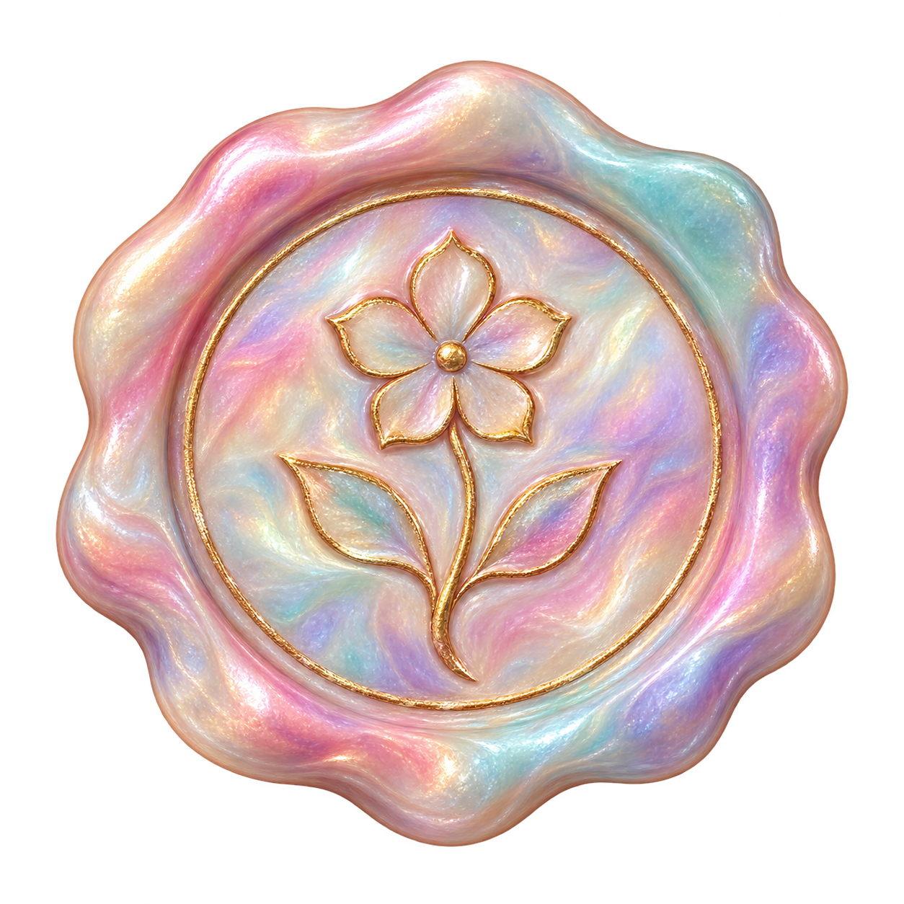

# 火漆章参考图

状态：用户已选择 C 组精致鎏金。正式 16 枚图标及纸质成就墙见 [实现说明](../README.md)。本目录保留第一轮候选图及原始检查记录。

由内置 imagegen 生成，使用统一的五瓣花、单茎双叶主题，正面视角与左上柔光。为了获得真实透明背景，保留 A1 原始图，其余采用同一构图规范重新生成；蜡边及压印有少量自然差异。

| 方案         | 松绿                        | 珠母极光                     |
| ------------ | --------------------------- | ---------------------------- |
| A · 复古哑光 |   |   |
| B · 细腻珠光 |   |   |
| C · 精致鎏金 |  |  |

- A：传统蜡质，较柔和的反光与表面颗粒。
- B：更明亮的珠光与更突出的立体光泽。
- C：细金色压印，更华丽，花枝轮廓更醒目。

这些是质感候选图；选定后需统一正式图标的边缘、主体占比、凹印方向与颜色，再批量制作。最高档固定采用珠母极光。

生成提示词和来源：见 [prompts.json](./prompts.json)。透明通道及边界检查：见 [qa.json](./qa.json)。

## 参考图检查记录

六张均为 1254×1254 PNG，具有实际 alpha 通道，约 40% 的画布完全透明。A2 与 C2 的一个角存在 1/255 的微弱 alpha 残留，因此严格的四角全零检查未通过，已如实保留在 qa.json 中。正式资产阶段需清理边缘并重新检查，不能将本轮参考图检查视为生产验收通过。

三组压印的凹凸感略有差异：A 更接近凹印，B/C 的高光使花瓣更有浮雕感；选定质感后需统一压印方向。
