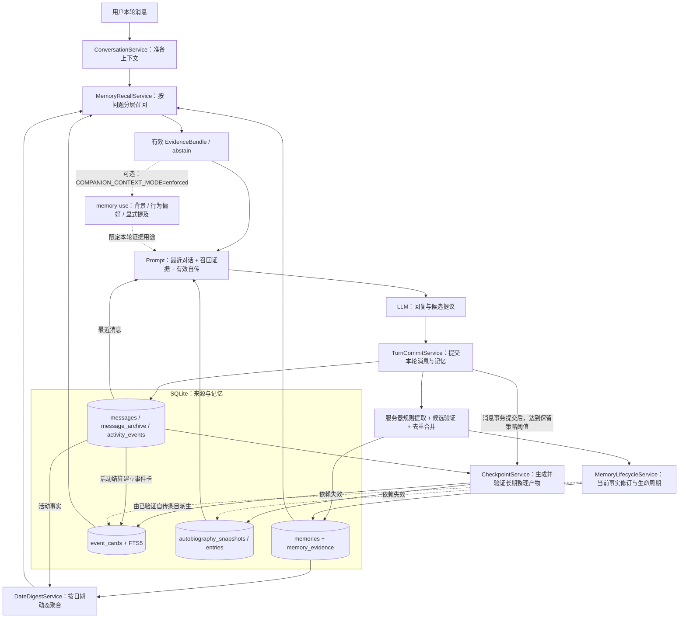
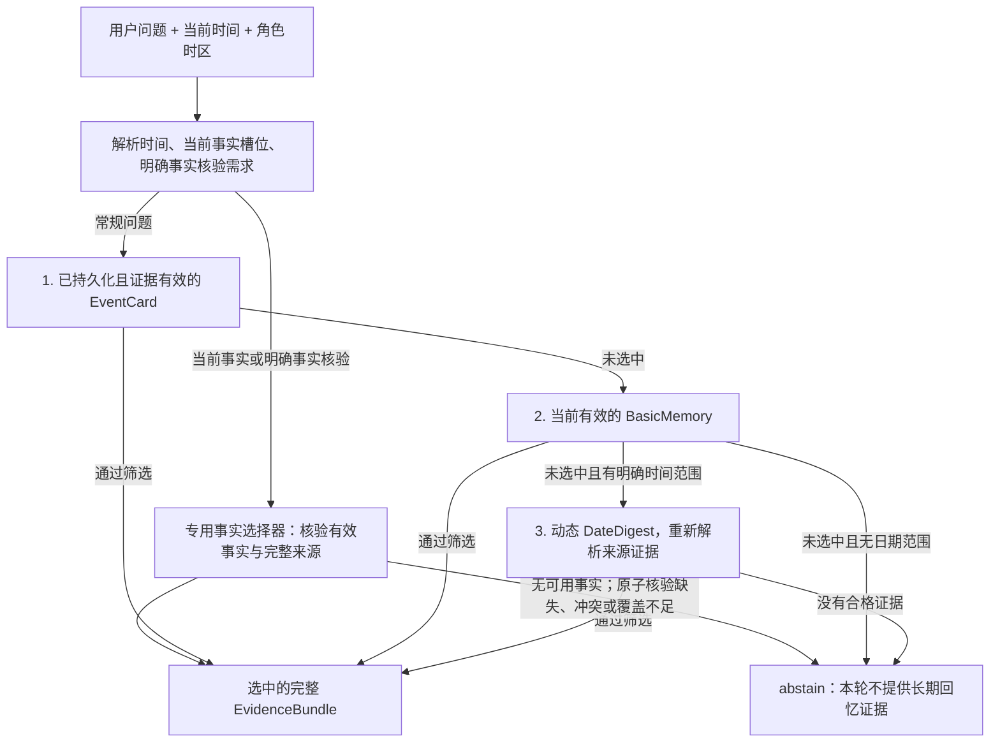

# 当前记忆系统架构

本文描述当前源码中的记忆服务、数据流与默认配置。实际实例配置可通过环境变量覆盖；用户可见的日记阅读层见[记忆档案室](memory-library.md)。

当前系统围绕**原始来源、结构化记忆、长期整理产物、带证据的召回**组织。后端负责来源验证、持久化和纠错，模型提供回复与候选内容。数据存储使用 SQLite，事件卡和原文归档使用 FTS5 索引。

## 总体架构

实线表示数据流，虚线表示带标签的条件分支或纠正后的失效传播。图中的召回流程以 `MEMORY_RECALL_MODE=enforced` 为准。

图中 `writeGate` 与当前事实修订发生在 `TurnCommitService` 的同一消息/记忆事务内；Checkpoint 是该事务提交后的独立步骤。活动结算也能通过 `SettlementService` 写入有来源的记忆和事件卡。

## 1. 记忆怎样形成

对话主入口是 `ConversationService`。回复准备完成后，由 `TurnCommitService.commit()` 在事务中写入用户消息、助手消息和本轮记忆。

记忆写入入口为 `validateMergeAndPersistMemories()`，主要步骤是：

1. 从实际存储的本轮用户消息中，重新提取服务器拥有的明确用户事实、偏好和连续性候选。这些候选排在模型候选之前。
2. 接收模型的有限候选提议。模型不拥有持久化 ID、来源 ID、时间戳、生命周期状态等字段；服务器将候选与真实消息或活动事件绑定。
3. 验证 Schema、原文引用、来源归属、确定性、时间语义及写入条件；`judgeMemoryCandidate()` 是代码规则判断。
4. 对内容及同一事实槽位去重，执行合并或强化，写入 `memories` 和 `memory_evidence`。
5. 在同一事务内调用 `reconcileNewMemories()`，处理新旧事实之间的替代、撤销及冲突。

这条链路会区分用户明确陈述、角色决定、活动结果和模型推断，也会区分“计划发生”与“已经发生”。候选提议只有通过这些检查后才成为可持久化的记忆。

关键入口：

- [turn-commit-service.ts](../apps/server/src/services/turn-commit-service.ts)：`commit()`，记忆写入与同步修订。
- [memory-service.ts](../apps/server/src/services/memory-service.ts)：`validateMergeAndPersistMemories()`、证据验证与持久化。
- [turn-decision-service.ts](../apps/server/src/services/turn-decision-service.ts)：服务器规则候选提取。
- [memory-judge.ts](../packages/features/src/memory-judge.ts)：记忆写入判定。

## 2. 系统保存了哪些内容

| 层次         | 数据结构或表                                                                          | 作用                                                                                                                 |
| ------------ | ------------------------------------------------------------------------------------- | -------------------------------------------------------------------------------------------------------------------- |
| 原始来源     | `messages`、`message_archive`、`activity_events`                                      | 保留消息原文与活动事实，为后续产物提供可核验来源；归档有 FTS5 索引。                                                 |
| 基础记忆     | `memories`                                                                            | 保存事实、偏好、经历、关系与承诺，以及归属、确定性、时间和生命周期。主要按 `agent_id` 查询，可跨同一角色的会话使用。 |
| 证据关联     | `memory_evidence`                                                                     | 将记忆连接到实际消息、活动事件等来源，并保存引用和证据语义。                                                         |
| 长期整理记录 | `conversation_checkpoints`                                                            | 记录整理范围、来源版本与哈希、处理状态以及生成产物。                                                                 |
| 自传         | `autobiography_snapshots`、`autobiography_entries`                                    | 保存版本化的长期叙事与有证据的条目；有效快照可作为对话上下文。                                                       |
| 事件检索索引 | `event_cards`、`event_cards_fts`                                                      | 将经过验证的自传条目或活动事件组织成可检索事件卡。                                                                   |
| 派生有效性   | `memory_derivation_dependencies`、`memory_derived_validity`、`agent_memory_revisions` | 记录来源依赖、失效状态与角色记忆版本，阻止旧解释重新进入当前上下文。                                                 |
| 召回诊断     | `retrieval_runs` 及关联记录                                                           | 保存召回输入、候选、选择结果与可重放信息，用于开发者检查。                                                           |
| 动态日期摘要 | `DateDigest`，不单独入库                                                              | 查询时聚合日期范围内的活动事实与符合条件的有效记忆。                                                                 |

`Memory.kind` 有四类：`semantic`（语义事实/偏好）、`episodic`（经历）、`relationship`（关系）、`commitment`（承诺）。另一个独立维度是 `namespace`：`canon`、`character_self`、`user_model`、`shared_relationship`、`runtime_simulation`。类型与命名空间共同表达“这是什么记忆、关于谁、来自哪里”。完整契约见 [memory.ts](../packages/contracts/src/memory.ts)。

## 3. 每一轮怎样想起过去

真实服务装配会向 `MemoryRecallService` 注入 `ContinuityIndexService` 与 `DateDigestService`，因此默认聊天使用分层召回实现。它先识别问题意图、日期范围与明确标识符，再依据不同问题选择证据。

上图是概括后的默认顺序，事实槽位、明确事实核验和部分关系问题有专门分支。当前事实槽位可以返回已验证的部分事实，并用 `factCoverage` 标注未覆盖部分；原子明确事实核验有更严格的完整覆盖要求。不同层会执行候选有效性、来源归属、引用完整性、时间范围和问题相关性检查，不能只凭相似词就进入回复。

检索技术包括事件卡/归档原文的 SQLite FTS5 与 BM25、中文词项匹配补充、基础记忆的 SQL 关键词/精确标识符查询，以及代码中的多因素评分。基础评分考虑词面、标签、时间、近因、重要性、置信度和来源可靠性；当前服务调用没有接入 embedding 或向量数据库。契约中的 `semanticSignals` 是扩展接口，不能据此认为当前运行链路已经使用语义向量检索。

在 `enforced` 聊天中，`requireDurableEvidence=true`。仅存在于原文归档的临时候选不能凭一段旧原文直接成为当前长期事实。非强制的预览/影子路径保留原文检索等比较逻辑，顺序与上述默认聊天路径不同。

结果传入 `assembleChatPrompt()`，与最近消息、当前状态、日历等上下文共同参与提示词预算。自传由独立上下文通道提供，但也必须通过有效性读取；针对部分当前事实查询，自传会被省略，避免旧叙事干扰当前事实。

关键入口：

- [conversation-service.ts](../apps/server/src/services/conversation-service.ts)：本轮召回、证据包与 Prompt 装配。
- [memory-recall-service.ts](../apps/server/src/services/memory-recall-service.ts)：召回服务门面、预览与重放。
- [memory-recall-hierarchy.ts](../apps/server/src/services/memory-recall-hierarchy.ts)：真实分层路由与专用选择器。
- [memory-recall.ts](../packages/features/src/memory-recall.ts)：候选相关性、证据评分及拒绝选择。
- [prompt-assembler.ts](../packages/features/src/prompt-assembler.ts)：证据、自传和最近对话的注入。

## 4. 长对话怎样整理成长期记忆

消息事务提交后，`ConversationContinuityService.commitTurn()` 根据自传模式调用 `CheckpointService.createIfNeeded()`。是否整理由保留策略判断，并非简单按固定周期执行。

Checkpoint 路径读取被选中的消息及可核验的证据，调用模型生成长期整理候选，然后由服务器验证自传及条目。正常路径中，事件卡来自这些已验证的自传条目。服务器在提交整理产物前再次核对来源版本、消息哈希、记忆版本和前一自传版本，最后在同一整理事务中保存自传、事件卡与 Checkpoint 结果。

活动事件另有直接建立事件卡的路径：`SettlementService` → `ContinuityIndexService.upsertActivityEvents()`。

`DateDigestService` 按查询解析出的时间范围动态读取事实并生成摘要。它会考虑当前有效性和事实的发生时间，因而纠正后的查询可以反映最新来源状态。

关键入口：[checkpoint-service.ts](../apps/server/src/services/checkpoint-service.ts)、[autobiography-service.ts](../apps/server/src/services/autobiography-service.ts)、[continuity-index-service.ts](../apps/server/src/services/continuity-index-service.ts)、[date-digest-service.ts](../apps/server/src/services/date-digest-service.ts)。

## 5. 用户纠正后怎样避免旧记忆复活

明确纠正或时间更新会形成带有 `claim.subjectKey` 和修订意图的新事实。`MemoryLifecycleService` 按同一事实槽位协调新旧记录，旧记忆可以变为 `superseded` 并指向替代项，历史记录仍被保留。

对依赖旧记忆或来源解释的派生内容，系统记录失效并更新记忆版本。后续召回、自传读取和相关派生内容读取都会检查有效性。聊天与 Checkpoint 在最终提交前也会复核读取时的记忆版本，避免并发纠正期间提交基于旧来源生成的结果。

生命周期契约还覆盖 `active`、`aging`、`archived`、`merged`、`forgotten`、`needs_review` 等状态；普通召回与历史/老化记忆查询使用不同的资格规则。这些状态不意味着一定会物理删除原文。

关键入口：[memory-lifecycle-service.ts](../apps/server/src/services/memory-lifecycle-service.ts)、[memory-lifecycle.ts](../packages/features/src/memory-lifecycle.ts)、[continuity-repository.ts](../apps/server/src/services/continuity-repository.ts)、[memory-validity-repository.ts](../apps/server/src/repositories/memory-validity-repository.ts)。

## 6. 默认配置与可选功能

| 配置                     | 代码默认值 | 对记忆系统的影响                                                                                                             |
| ------------------------ | ---------- | ---------------------------------------------------------------------------------------------------------------------------- |
| `MEMORY_RECALL_MODE`     | `enforced` | 聊天应用有持久化来源证据的召回结果；`shadow` 记录比较结果但继续使用旧上下文；`legacy` 使用旧读取路径。                       |
| `AUTOBIOGRAPHY_MODE`     | `enforced` | 允许按条件生成长期整理产物，并读取有效自传进入上下文；`shadow` 可生成但不注入自传。                                          |
| `COMPANION_CONTEXT_MODE` | `off`      | 开启为 `enforced` 后，使用 `selectMemoryUseForTurn()` 将同一证据集分配给背景理解、范围内行为偏好和显式提及，并限制重复提及。 |
| `PERSONA_RUNTIME_MODE`   | `off`      | 开启为 `enforced` 后，接入有效人格/相处实践快照与记忆抑制信息。                                                              |

此外，基础记忆写入和召回还受角色能力中的 `longTermMemory` 与每轮候选数限制。这些默认值来自 [config.ts](../apps/server/src/config.ts)，实际部署可通过环境变量覆盖。

## 7. 从哪里继续看代码

| 要理解的问题               | 首选代码位置                                                                                                                                                              |
| -------------------------- | ------------------------------------------------------------------------------------------------------------------------------------------------------------------------- |
| 服务怎样被装配在一起       | [composition/plugins.ts](../apps/server/src/composition/plugins.ts)                                                                                                       |
| 一轮对话如何读取和使用记忆 | [conversation-service.ts](../apps/server/src/services/conversation-service.ts)                                                                                            |
| 什么内容能被记住           | [memory-service.ts](../apps/server/src/services/memory-service.ts) + [memory-judge.ts](../packages/features/src/memory-judge.ts)                                          |
| 怎样决定召回哪一条         | [memory-recall-hierarchy.ts](../apps/server/src/services/memory-recall-hierarchy.ts)                                                                                      |
| 纠正、替代及派生失效       | [memory-lifecycle-service.ts](../apps/server/src/services/memory-lifecycle-service.ts) + [continuity-repository.ts](../apps/server/src/services/continuity-repository.ts) |
| 长期自传和事件索引怎样形成 | [checkpoint-service.ts](../apps/server/src/services/checkpoint-service.ts)                                                                                                |
| 数据契约与证据字段         | [contracts/src/memory.ts](../packages/contracts/src/memory.ts) + [memory-evidence.ts](../packages/contracts/src/memory-evidence.ts)                                       |

开发者接口保留了记忆列表 `GET /api/agents/:id/memories`、召回预览 `POST /api/developer/agents/:id/memory-recall-preview`、召回运行记录及重放接口。前端“记忆”主导航进入日记档案室，时间线路由仍保留。日记属于来源派生的阅读层；定位底层记忆写入和召回时应从后端服务入口开始。
