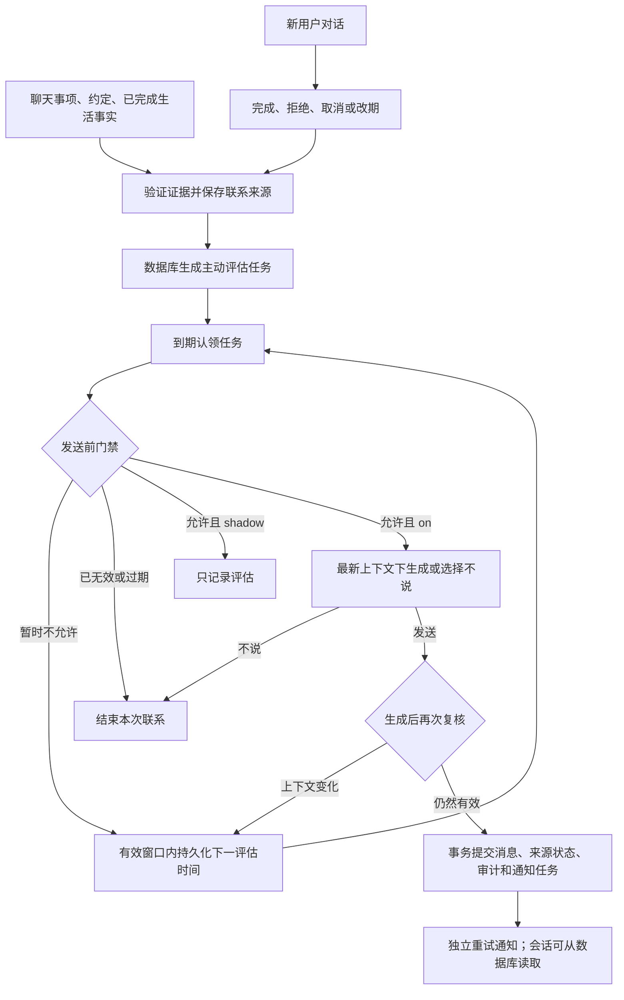

# 主动消息：触发、生命周期与投递

本文对应 2026-09-17 的实现。主动消息只有在存在有效联系理由、当前允许打扰、生成后上下文仍有效时才提交。任务到期代表获得一次评估机会。

## 启用与运行方式

```dotenv
PROACTIVE_MODE=shadow
PROACTIVE_EXECUTION=resident
```

| 配置                                   | 行为                                                                   |
| -------------------------------------- | ---------------------------------------------------------------------- |
| `PROACTIVE_MODE=off`                   | 不发现或认领新的主动联系评估任务                                       |
| `PROACTIVE_MODE=shadow`（默认）        | 推进确定性来源、保存任务和门禁评估；不调用主动消息模型，不写聊天消息   |
| `PROACTIVE_MODE=on`                    | 通过门禁后允许模型作出发送或不发送决定，再复核并提交                   |
| `PROACTIVE_EXECUTION=resident`（默认） | 常驻进程启动时扫描数据库；到期唤醒，空闲时最多间隔 30 秒扫描           |
| `PROACTIVE_EXECUTION=worker`           | 使用相同的数据库任务和租约，在持续运行的 worker 中执行                 |
| `PROACTIVE_EXECUTION=lazy`             | 不启动后台循环；只在显式调用 catch-up 时执行，不承诺无人操作时自动触发 |

主动调度与书信配置独立，`CORRESPONDENCE_MODE=off` 不会关闭主动调度。运行范围来自数据库内已发布的角色，不依赖 SSE 在线列表。影子模式与正式发送使用独立任务键：观察过的有效来源在切换到 `on` 后仍会重新通过真实门禁。

实际发送需要三个条件同时成立：服务模式为 `on`、角色为 `high_fidelity`（拟真档）、角色 `proactivePolicy.enabled=true`。角色编辑器“生活策略 → 主动联系”可配置允许主动联系、日上限、静默时间、关系门槛及分享类别。已有角色保存的关闭偏好不会被迁移批量改成开启。

## 一、哪些事情产生联系意图

| 来源               | 必要条件                                                       | 存储                   |
| ------------------ | -------------------------------------------------------------- | ---------------------- |
| 明确提醒、约定联系 | 用户原话或经验证的相邻对话承诺，有真实引文和可解析时间         | `follow_up_intents`    |
| 用户事项的后续关心 | 已表达的未来事项，有来源证据，关心目的尚未满足                 | `follow_up_intents`    |
| 角色生活分享       | 已完成的可信活动，具备分享价值，角色允许主动联系且关系达到门槛 | `proactive_candidates` |

聊天模型只能提出候选，不能凭空授权跟进。服务端核对消息归属、说话人、原话、相关上下文、来源链和内容哈希；相对时间以原始消息时间解析，不以抽取/重试当天解析。不可确认的时间不进入主动发送队列。

生活分享同时接收旧版活动结算和默认 fuzzy life 的已完成 `LifeOutcome`。模糊生活必须带来源证据，保留日期/时段精度，不能把 `DailyLifeIntent` 计划直接写成已发生事实。日期早于角色当地昨天的模糊生活结果不会在重新上线后补成新鲜分享。兼容活动事件保留 outcome ID、intent ID、证据 ID 和精度，审计时间不冒充精确发生时间。

分享价值与故事重要性分开：明确 `shareable`、分享价值达到阈值，或允许类别内与用户有关的事实才进入候选；不再要求所有可分享事实都达到 `narrativeImportance >= 0.7`。有用户消息证据的相关进展优先，重要性只用于材料排序。

本版没有新增“沉默多久就随机搭话”、早晚安或纪念日触发器。`CareCue` 仍是用户主动聊天时可以自然提及的线索，不是主动发送来源。

## 二、后续对话怎样关闭或改期

事项状态与联系决策分开。发送一次消息只会记为 `sent`，不会把事情标成已解决；模型决定不联系也不会伪造用户取消或事项完成。

| 用户表达                           | 处理                                                                         |
| ---------------------------------- | ---------------------------------------------------------------------------- |
| “面试通过了，明天去报到”           | 将“面试通过了”绑定到面试事项，关闭面试结果跟进；报到的未来时间不覆盖已知结果 |
| “面试结束了，还在等结果”           | 对以结果为目的的跟进保留 pending；不能把结束等同于结果已知                   |
| “面试没有通过”                     | 结果已知，可以关闭结果跟进；负面结果也是真实结果                             |
| “面试改到周五下午了”               | 在同一事项 ID 上更新窗口、证据与版本；旧任务失效，不重复保留旧约定           |
| “面试取消了”                       | 有相关事项证据时取消                                                         |
| “这件事别再问了”                   | 只有上一条对话能够唯一指向当前事项时应用拒绝，避免取消其它无关事项           |
| 不相关、假设性或无法消除歧义的表达 | 不以关键词强行判定其它事项的结果                                             |

改期会增加 revision/generation epoch，并保存改期消息的证据。已在生成的旧任务无法通过提交检查。同一来源的重复抽取与已记录的取消/解决经过生命周期和去重检查，不会每次扫描重新创建。

## 三、时间窗口

| 语义                                         | 最早联系时间                                                              | 有效期                                                     |
| -------------------------------------------- | ------------------------------------------------------------------------- | ---------------------------------------------------------- |
| 明确提醒或约定                               | 使用用户指定钟点；笼统上午/中午/下午/晚上分别采用 09:00/12:00/15:00/20:00 | 2 小时                                                     |
| 有明确开始钟点的事项关心                     | 默认在事件开始后 2 小时评估；这是关心窗口，不代表已确认事件结束           | 领域默认 72 小时，主动调度将实际来源窗口收紧至最多 48 小时 |
| 笼统上午/中午/下午事项                       | 12:00/14:00/18:00 之后关心                                                | 同上                                                       |
| 笼统晚上事项，或默认事后关心落在 22 点及以后 | 次日 10:00 之后评估                                                       | 同上                                                       |
| 生活分享                                     | 可信材料入池后，且话题冷却结束                                            | 来源审计时间起 6 小时                                      |

支持今天、明天、明早、明晚、后天、明确星期、数字天后和中英文钟点；中文数词钟点也能解析。单独“下周”“最近”不能确定安全日期，不擅自选择一天。非法显式时间不能悄悄回落到默认时间。

所有时间均按角色时区解释，并保存 UTC。实际评估始终要求 `earliestAtUtc <= now < expiresAtUtc`。静默时间的开始包含在内、结束不包含；跨午夜有效；开始与结束相同表示全天静默。

静默、配额和冷却只会在有效窗口内延后。下一允许评估时间不早于过期时间时，本次联系结束，不向未来无限顺延。即使用户明确要求提醒，也不突破静默与关闭偏好。

## 四、持久化调度与去重



任务类型是 `proactive.follow_up` 与 `proactive.activity_review`，复用 `TemporalTaskScheduler` 和 `temporal_tasks`，由独立实例驱动。任务键包含运行模式、来源种类、来源 ID 和语义指纹；语义指纹包含窗口、内容和证据，不包含仅因认领而增加的 revision。因此一次生成失败不会自动变成一件“新事情”，改期等真实变化会得到新的有效评估。

事件幂等与话题冷却分别处理：相同事件 ID 只创建一次候选，即使旧候选已过期、取消或发送也不重复创建；不同日期的同名事件可以创建新候选，受同话题 24 小时冷却约束。提交前根据真实已发送消息再次计算话题冷却，避免前一个候选延迟发送后第二个候选紧随其后。

任务和生成都有最长 30 分钟租约，跨进程认领使用数据库约束和 token。恢复后重新扫描数据库；过期来源失效，正在执行但租约过期的生成可恢复，不补发多日积压。

## 五、发送前的完整门禁

每项都必须通过；`shadow` 也使用同一组便宜的确定性判断，不调用主动消息模型。

1. 角色和会话存在、会话属于角色、档位支持且角色策略允许。
2. 当前角色没有未结束的主动生成；来源仍 pending，证据有效，没有当前版本的“不联系”决定。
3. 来源已经到期但未过期；follow-up 尚未发送，最多主动联系一次；没有在会话里讨论/投递过该来源。
4. 不处于角色设定的静默时间。
5. 该角色本地日内已发送数量小于 `maxMessagesPerDay`（用户可设 0–2）。
6. 同一用户/租户数据库内所有角色，滚动 24 小时主动消息少于 4 条，距离任何角色最近一条主动消息至少 30 分钟。
7. 关系亲近度达到该角色 `minimumCloseness`。
8. 距离该角色上一条主动消息至少 2 小时；生活分享还必须满足同话题 24 小时冷却。
9. 该角色在用户上次回复后未回复的主动消息少于 2 条。沉默不会制造无限追问。
10. 没有用户请求正在处理，也没有刚结束的对话（默认 2 分钟窗口）。任意角色的用户消息/正常回复都算用户活动。

角色日配额使用角色时区；用户总预算采用滚动 24 小时，避免多个角色时区不同产生预算漏洞。本地单用户实例以整个数据库为用户范围，托管运行以每个用户独立的租户数据库为范围。

用户请求到达 HTTP 入口、等待角色队列之前就登记活动 epoch 和持久化租约。独立 worker 能看到尚未写入聊天记录的用户请求。单纯打开页面、浏览历史或连接 SSE 不会被当作正在聊天。本版尚未采集“只在输入框打字但未发送”的独立信号。

## 六、生成、复核与原子提交

通过门禁后才在事务中认领来源，保存角色版本、状态版本、来源版本、生成 epoch、claim token、最后消息 rowid、用户到达 epoch。模型调用在事务与角色锁外执行，以免阻塞正常聊天。

生成输入包含当前时间、有效窗口、角色人格、来源材料/跟进目标、最近 12 条对话和提醒语义。模型输出 `decision=send` 或 `decision=skip`。`skip` 是正常完成的联系决定，记录到 `proactive_intent_decisions`；同一来源版本不会一轮轮强迫模型最终发出消息。模型/网络故障返回失败，由持久化任务退避，不会以通用草稿强制发送。

发送前再次检查：

- 生成 run、claim token、epoch 和来源版本仍匹配；租约未过期。
- 角色 spec/state 没变；没有新的用户请求、用户消息或其它新消息。
- 来源仍归当前 run 持有，证据链仍有效，没有被取消、解决、改期、讨论或过期。
- 静默、角色日配额、用户总配额、冷却和活动状态仍通过。这一步位于 SQLite 写事务内，因此不同角色并发生成也不能突破总预算。

通过后，在同一事务里写入 `assistant_proactive` 消息、标记来源已发送、记录 generation 提交状态和审计事件、更新会话，并插入以 message ID 为主键的 `proactive_notification_outbox`。任何一步失败整笔回滚。

## 七、延后与终止

| 原因                                            | 下一步                                                |
| ----------------------------------------------- | ----------------------------------------------------- |
| 静默                                            | 下一个静默结束点，仍须处于有效窗口                    |
| 角色日配额耗尽                                  | 角色本地次日开始后重新评估，随后仍会检查静默          |
| 用户滚动预算耗尽                                | 最老一条预算内主动消息离开 24 小时窗口后              |
| 角色冷却                                        | 已知冷却结束时间                                      |
| 用户活动、新消息、生成时用户回来                | 丢弃旧正文，约 2 分钟后重新评估有效意图               |
| 跨角色冷却或已有生成                            | 约 30 分钟后重新评估                                  |
| 未回复上限、关系不足、策略暂不允许/会话尚未建立 | 低频重新评估，受有效窗口约束                          |
| 生成/执行错误                                   | 指数退避，最多 3 次实际执行失败；门禁延后不算模型失败 |
| 来源失效、完成、取消、已讨论、过期、窗口无交集  | 终止                                                  |
| 模型选择不联系                                  | 成功结束当前联系版本，保存原因                        |

每个任务最多 64 次评估作为额外上限。暂时被阻止与来源永久无效分别记录原因和下次评估时间。用户已解决或拒绝的事情不能因调度器重启重新出现。

## 八、通知、离线与诊断边界

`proactive_notification_outbox` 单独分发 `message.created`，失败从 5 秒开始指数退避，最长 1 小时；重试不会重新调用模型或写聊天。提交后崩溃可在下次扫描恢复通知任务。分发进程必须实际持有该角色的 SSE 订阅：没有本地订阅的 worker 不消费 outbox，离线记录保持 pending，HTTP 进程在连接恢复后分发。`processed` 表示通知分发函数处理完成，不表示用户已读，也不保证操作系统弹窗已送达。

当前接通的是应用会话和 SSE。没有 SSE 客户端时，消息仍保存在数据库，重新打开会话可以读取；这里没有新增 Cloudflare、手机系统或浏览器关闭后的远程推送通道。外部系统通知的“绝对只一次”也不在本地事务的保证范围内。

支持多个生成 worker 竞争同一数据库，以及一个持有浏览器订阅的 HTTP 进程；多个 HTTP 副本之间的 SSE 广播仍需要共享消息总线，当前内存 SseHub 不提供跨副本广播。

本地所有进程停止时不会实时生成新消息。有持续运行的服务/worker 时可以在聊天页不在线的情况下评估；托管租户也遵守其 runtime 激活/闲置回收机制，不能把被回收的进程描述为持续在线。

主要诊断表：

| 表                                           | 用途                                       |
| -------------------------------------------- | ------------------------------------------ |
| `follow_up_intents` / `proactive_candidates` | 来源与事项/发送状态、证据和有效窗口        |
| `temporal_tasks`                             | 评估任务、租约、尝试次数及下次到期时间     |
| `proactive_task_evaluations`                 | shadow/on 评估结果、拒绝原因和下次评估时间 |
| `proactive_generation_runs`                  | 两阶段生成、丢弃原因、claim token、消息 ID |
| `proactive_intent_decisions`                 | 当前来源版本成功决定不联系的记录           |
| `proactive_notification_outbox`              | 通知重试与处理状态                         |

```sql
SELECT t.agent_id, t.entity_id, e.mode, e.outcome, e.reason_code,
       e.evaluated_at_utc, e.next_evaluation_at_utc
FROM proactive_task_evaluations e
JOIN temporal_tasks t ON t.id = e.task_id
ORDER BY e.evaluated_at_utc DESC
LIMIT 100;
```

重点观察旧话题误触发、取消后触发、重复提交、静默违规、不具备有效理由时的模型调用，以及用户关闭功能的情况。影子结果 `shadow_eligible` 只证明确定性门禁通过，不代表模型已决定发送。
